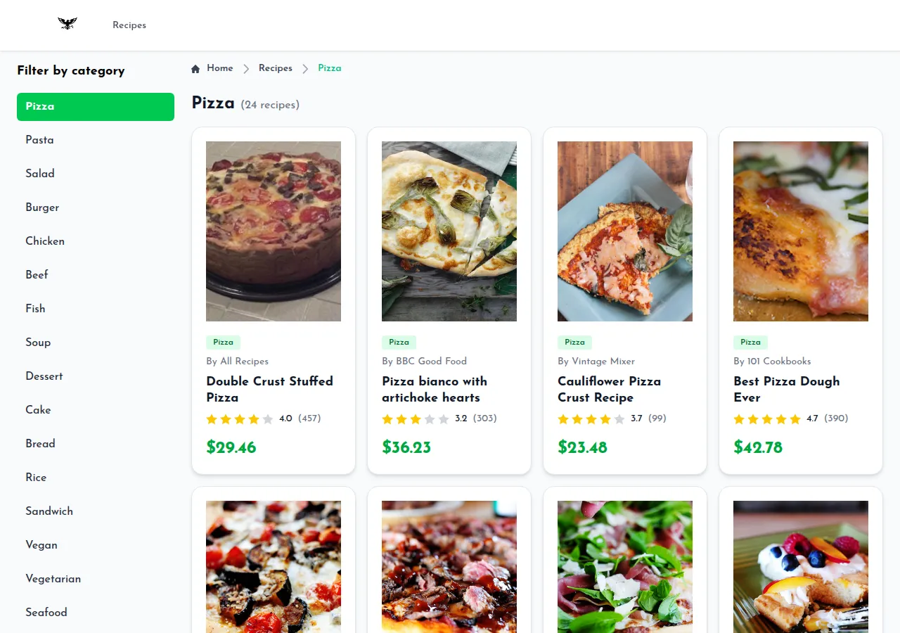
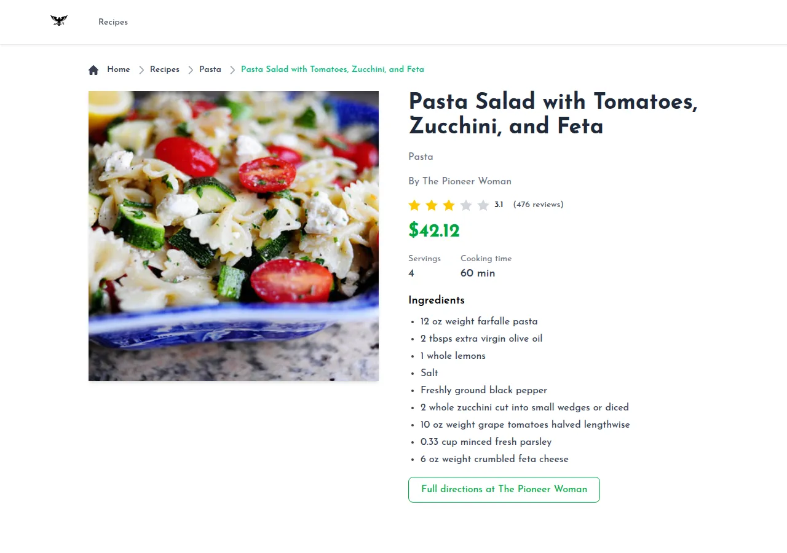
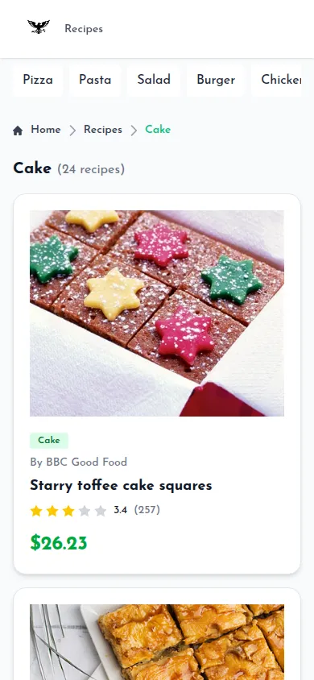

# Recipe Store (Next.js App Router)

A recipe catalogue built as a Next.js lab at ITI (Information Technology Institute): browse 16 categories,
open a recipe for its ingredients, servings and cooking time, and follow the link to the original directions.

**Live demo: https://montaser-hub.github.io/nextjs-recipe-store/**



| Recipe page | Phone |
|---|---|
|  |  |

## What it demonstrates

- **App Router** with nested dynamic routes: `/recipes/[category]` and `/recipes/[category]/[recipeId]`.
- **Server components** that read data at build time; only the breadcrumb is a client component.
- **Static generation** of every page with `generateStaticParams` and `dynamicParams = false`, so unknown
  categories and recipes are real 404s. The whole site is a static export served by GitHub Pages.
- **Per-page metadata** (`generateMetadata`), loading, error and not-found states.
- A responsive layout: a category column on desktop, a scrollable row of chips on phones.

## Data

Recipes come from the [Forkify API](https://forkify-api.herokuapp.com/), a free teaching API limited to 500
requests an hour. Pre-rendering every page against it at build time gets rate-limited, so
`npm run snapshot` saves the catalogue (up to 24 recipes per category) to `src/data/recipes.json`, and the
build reads that file. The script waits out rate limits and can resume if interrupted. The site keeps working
even if the API goes offline.

Forkify has no prices or ratings. The demo derives them from each recipe's id with a hash, so a recipe shows the
same price on the list and on its own page.

## Running locally

```bash
npm install
npm run dev        # http://localhost:3000
npm run build      # static site in out/
npm run snapshot   # refresh src/data/recipes.json (a few minutes)
npm run deploy     # build with the /nextjs-recipe-store base path and publish to gh-pages
```

## Tech stack

Next.js 15 (App Router, static export) · React 19 · TypeScript · Tailwind CSS 4

## Changes after the course

- The build failed: an unfinished Google sign-in and profile page imported files that didn't exist. They were removed.
- Prices and ratings were random on every render, so a recipe showed one price in the list and another on its page.
- The recipe page always showed "Pizza" as the category, and category page titles read "Recipes: [object Object]".
- The sidebar had a fixed width that broke the layout on phones, and "Add to cart", "Order now" and "Wishlist"
  buttons did nothing; the recipe page now links to the source instead.
